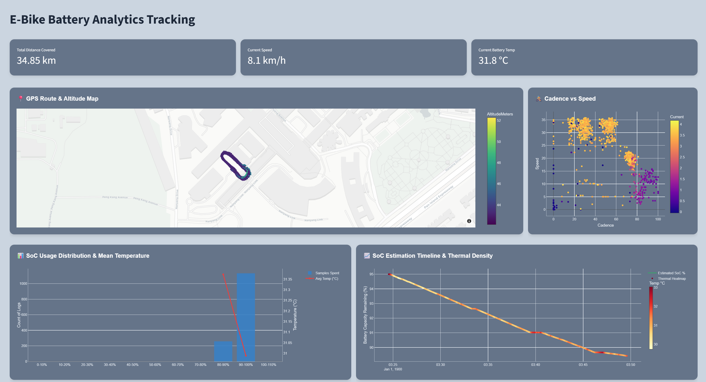

# 🚴 E-Bike Battery Analytics Tracking

> An interactive real-time dashboard for visualizing e-bike trip data, battery health, and performance metrics — built with Streamlit and Plotly.


---

## 📸 Dashboard Preview




---

## 📋 Table of Contents

- [Overview](#-overview)
- [Features](#-features)
- [Tech Stack](#-tech-stack)
- [Project Structure](#-project-structure)
- [Getting Started](#-getting-started)
- [Data Format](#-data-format)
- [Deployment](#-deployment)
- [Configuration](#-configuration)
- [Contributing](#-contributing)
- [License](#-license)

---

## 🔍 Overview

The **E-Bike Battery Analytics Tracking** dashboard provides a comprehensive visual interface for analyzing e-bike trip logs. It processes raw `.parquet` sensor data and renders interactive charts covering GPS routing, battery State of Charge (SoC), thermal behavior, cadence, and speed — all within a polished, card-based dark UI.

The primary goal is to support battery characterization workflows, trip performance review, and thermal health monitoring in a single unified view.

---

## ✨ Features

| Feature | Description |
|---|---|
| 🗺️ **GPS Route Map** | Interactive Mapbox scatter map colored by altitude |
| ⚡ **KPI Metrics** | Real-time cards for distance, speed, and battery temperature |
| 🔋 **SoC Timeline** | State of Charge estimation over trip duration with thermal heatmap overlay |
| 📊 **SoC Distribution** | Histogram of time spent per SoC range with average temperature line |
| 🚴 **Cadence vs Speed** | Scatter plot correlating pedaling cadence to speed, colored by current draw |
| 🎛️ **Time Range Filter** | Sidebar `select_slider` snapping to 5-minute intervals for trip segmentation |
| 🎨 **Styled Card Layout** | All charts wrapped in dark-grey rounded cards via `components.html()` injection |
| 🔄 **Live Data Refresh** | One-click cache-busting button to reload the source parquet file |

---

## 🛠️ Tech Stack

- **[Streamlit](https://streamlit.io/)** — App framework and layout engine
- **[Plotly Express & Graph Objects](https://plotly.com/python/)** — Interactive chart rendering
- **[Pandas](https://pandas.pydata.org/)** — Data ingestion and transformation
- **[NumPy](https://numpy.org/)** — Numerical computation
- **[PyArrow](https://arrow.apache.org/docs/python/)** — Parquet file engine

---

## 📁 Project Structure

```
your-project/
│
├── app.py                          # Main Streamlit application
├── requirements.txt                # Python dependencies
├── README.md                       # Project documentation
│
├── ev-battery-storage/
│   └── processed-files/
│       └── CadenceTest_processed.parquet   # Source trip data
│
└── assets/
    └── dashboard_preview.png       # Screenshot for README (optional)
```

---

## 🚀 Getting Started

### Prerequisites

- Python 3.9 or higher
- pip

### 1. Clone the Repository

```bash
git clone https://github.com/YOUR_USERNAME/YOUR_REPO_NAME.git
cd YOUR_REPO_NAME
```

### 2. Install Dependencies

```bash
pip install -r requirements.txt
```

### 3. Add Your Data File

Place your processed parquet file at:

```
ev-battery-storage/processed-files/CadenceTest_processed.parquet
```

### 4. Run Locally

```bash
streamlit run app.py
```

The app will open at `http://localhost:8501`.

---

## 📂 Data Format

The dashboard expects a `.parquet` file with the following columns:

| Column | Type | Description |
|---|---|---|
| `Time` | `string` | Timestamp in `HH:MM:SS` format |
| `LatitudeDegrees` | `float` | GPS latitude |
| `LongitudeDegrees` | `float` | GPS longitude |
| `AltitudeMeters` | `float` | Altitude in metres |
| `DistanceMeters` | `float` | Cumulative trip distance |
| `Speed` | `float` | Speed in km/h |
| `Cadence` | `float` | Pedal cadence in RPM |
| `Current` | `float` | Battery current draw in Amperes |
| `Temp` | `float` | Battery temperature in °C |
| `SoC` | `float` | State of Charge in % (0–100) |

> If your dataset uses different column names, update the references in `app.py` accordingly.

---

## ☁️ Deployment

This app is deployed on **Streamlit Community Cloud**.

### Live App

🔗 **[your-app-name.streamlit.app](https://your-app-name.streamlit.app)**

### Deploy Your Own Fork

1. Fork this repository
2. Go to [share.streamlit.io](https://share.streamlit.io) and sign in with GitHub
3. Click **New app** → select your fork → set main file to `app.py`
4. Click **Deploy**

> **Note:** The repository must be public for the free Streamlit Community Cloud tier.

---

## ⚙️ Configuration

### Changing the Data File Path

The file path is resolved dynamically relative to `app.py`:

```python
BASE_DIR = os.path.dirname(os.path.abspath(__file__))
FILE_PATH = os.path.join(BASE_DIR, "ev-battery-storage", "processed-files", "CadenceTest_processed.parquet")
```

### Changing the Time Slider Frequency

The sidebar slider snaps to 5-minute intervals by default. To change this, update the `freq` parameter:

```python
time_marks = pd.date_range(start=snapped_min, end=snapped_max, freq="5min")  # change "5min" here
```

### Adjusting Chart Card Height

Each chart card height is controlled individually at the `render_card()` call:

```python
render_card("📍 GPS Route & Altitude Map", fig_map, height=420)  # adjust height here
```

---

## 🤝 Contributing

Contributions, issues, and feature requests are welcome.

1. Fork the repository
2. Create a feature branch (`git checkout -b feature/your-feature`)
3. Commit your changes (`git commit -m 'Add your feature'`)
4. Push to the branch (`git push origin feature/your-feature`)
5. Open a Pull Request

---

## 📄 License

This project is licensed under the MIT License. See the [LICENSE](./LICENSE) file for details.

---

<div align="center">
  <sub>Built with ❤️ using Streamlit & Plotly</sub>
</div>
